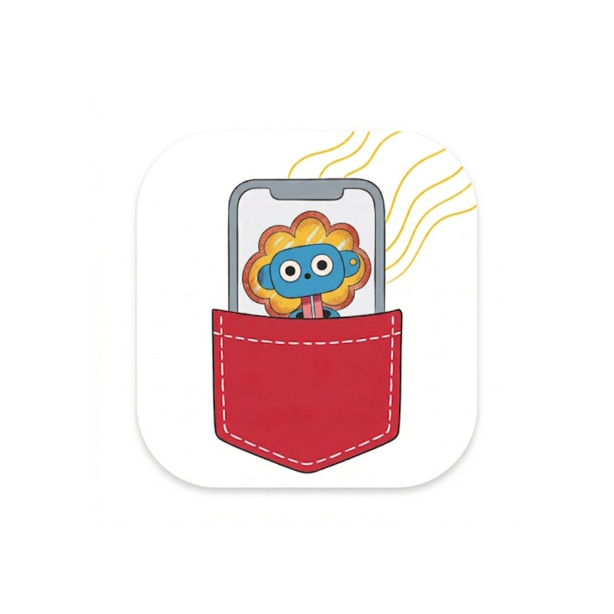
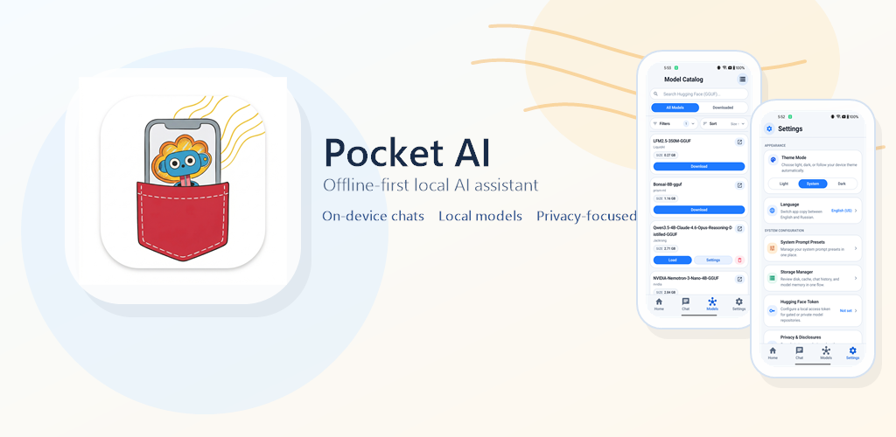
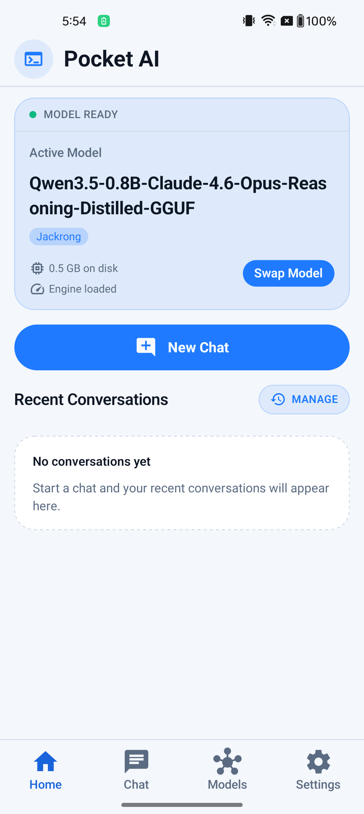
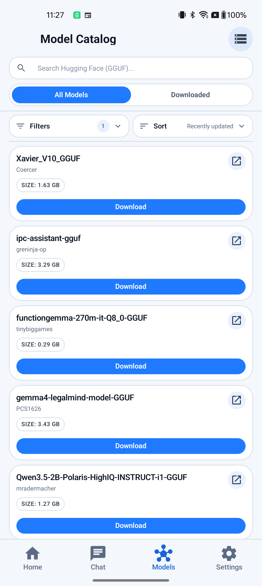
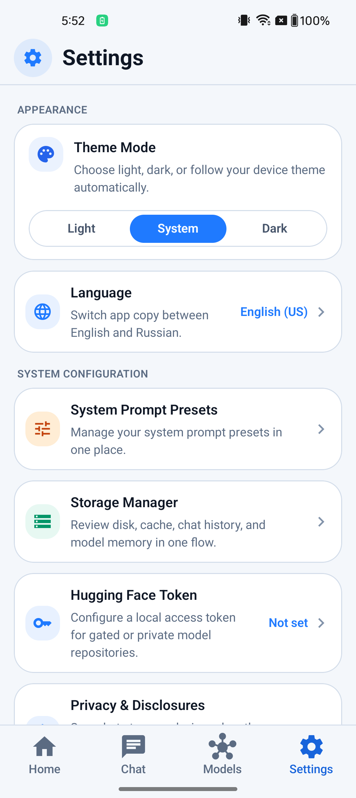

<p align="center">
  
</p>

<h1 align="center">Pocket AI</h1>

<p align="center">
  <strong>Offline-first local AI assistant &mdash; discover, download, and chat with GGUF models directly on your device.</strong>
</p>

<p align="center">
  <a href="https://github.com/Tah10n/pocket-ai/blob/main/LICENSE">
    
  </a>
  <a href="https://github.com/Tah10n/pocket-ai/actions/workflows/ci.yml">
    
  </a>
  
  
  
  
</p>

<p align="center">
  
</p>

<table align="center">
  <tr>
    <td align="center"><strong>Home</strong></td>
    <td align="center"><strong>Model Catalog</strong></td>
    <td align="center"><strong>Settings</strong></td>
  </tr>
  <tr>
    <td></td>
    <td></td>
    <td></td>
  </tr>
</table>

## How it works

1. **Search** — browse GGUF models from Hugging Face right on your phone.
2. **Download** — choose a GGUF file variant/quantization and download it to local storage.
3. **Load** — the model runs through [`llama.rn`](https://github.com/mybigday/llama.rn) entirely on-device.
4. **Chat** — have private conversations with zero network dependency, including switching models inside an existing conversation.

## Features

### Model Discovery

- Browse and search Hugging Face GGUF models with popularity sorting
- Guided discovery mode that surfaces RAM-friendly, token-free models first
- Choose concrete GGUF file variants/quantizations from model cards and model details
- Variant-aware size and RAM-fit labels before download
- Model details with tags, popularity, access state, and Hugging Face deep links
- Optional Hugging Face access token for gated or private repositories
- Locked and access-denied states shown for gated models instead of generic errors

### On-Device Inference

- Fully local chat after download — no network needed for conversations
- Background generation support with system notifications (Android foreground service, iOS time-limited)
- Per-model generation controls: temperature, top-p/k, min-p, repetition penalty, seed
- Load profiles for GPU layers, context window, and KV cache precision
- Hardware acceleration when available (Android OpenCL GPU, Android Hexagon/HTP NPU (experimental) via [`llama.rn`](https://github.com/mybigday/llama.rn)). Pocket AI uses backend discovery to decide what is safe to attempt; if discovery is unavailable, it forces CPU for stability.
- MTP speculative decoding for compatible GGUF models, including embedded MTP models and Gemma models that publish a separate MTP draft GGUF
- RAM-aware safety checks that block loading models that won't fit
- Context window bounded by model metadata and estimated device RAM headroom

### Chat & History

- Persistent on-device chat history, encrypted at rest
- Capability-gated chat attachments for images, audio, and local documents
- In-chat model switching keeps one conversation thread while recording when the active model changes
- Per-message model metadata keeps edits, regeneration, and history restoration aligned with the model that produced each turn
- System prompt presets for different assistant behaviors
- Conversation search, rename, retention controls, and bulk cleanup

### Storage & Data

- Storage manager for unloading, offloading, and clearing model data
- Per-model settings survive model removal for easy re-download
- Downloads track the selected GGUF file variant so verification and re-download target the same file
- Optional Gemma MTP draft files use the same resumable download, verification, cleanup, and storage-accounting lifecycle as other model artifacts
- Bounded local cache for catalog results with online revalidation
- Background model downloads with a persistent progress notification on Android
- Explicit confirmation before downloading models with unverified file sizes
- Storage, memory, and model size labels use decimal units (1 GB = 1,000,000,000 bytes)

### Localization & Theming

- English and Russian localization
- Light, dark, and system theme modes

## Tech stack

| Layer | Technology |
|-------|-----------|
| Framework | [Expo](https://expo.dev) + [React Native](https://reactnative.dev) |
| Navigation | [Expo Router](https://docs.expo.dev/router/introduction/) |
| Language | [TypeScript](https://www.typescriptlang.org/) |
| Styling | [NativeWind](https://www.nativewind.dev/) (Tailwind CSS for React Native) |
| State | [Zustand](https://zustand.docs.pmnd.rs/) |
| Storage | [MMKV](https://github.com/mrousavy/react-native-mmkv) |
| Inference | [llama.rn](https://github.com/mybigday/llama.rn) |

## Getting started

> **Note:** Pocket AI requires a native build environment. It is not compatible with Expo Go because local inference depends on native modules.

### Prerequisites

- Node.js 20.19.4+ and npm
- Android Studio (Android) or Xcode (iOS)

### Quick start

```bash
npm install
npm start          # Start Metro
npm run android    # Run on Android
npm run ios        # Run on iOS
```

`npm run android` prefers a connected phone. When no phone is available, it reuses a
running emulator or starts an available AVD; pass `--emulator` to force emulator use or
`--serial <serial>` to select an exact target.

If Metro reports `Unable to deserialize cloned data`, or a connected debug build keeps
showing behavior from an older bundle, restart through the cache-reset path:

```bash
npm run android -- --clear-metro-cache
```

The launcher avoids reusing an already-running Metro for this explicit reset and connects
the device to a fresh instance.

For release builds and signing setup, see the [Android Build Guide](docs/android-build.md) and [iOS Build Guide](docs/ios-build.md).

## Tests and coverage

```bash
npm test
```

With a connected Android debug device, the explicit Storage Manager cache-clear flow can be verified against a real private-cache sentinel:

```bash
npm run android:scenarios:storage -- --skip-build
```

This check clears rebuildable app cache data and is intentionally not part of the default or `all` scenario packs.

For current-source Android validation, run the fail-closed runtime and attachment packs. The
branch-regeneration pack builds and installs a provenance-verified release APK and then runs
an ordered, destructive recovery matrix:

```bash
npm run android:scenarios:runtime -- --fail-on-skip
npm run android:scenarios:attachments -- --fail-on-skip
npm run android:scenarios:branch-regeneration -- --fail-on-skip
```

The branch pack requires a prepared disposable conversation fixture and clears chat history
at the end. Use synthetic, non-sensitive fixture content because screenshots and UI
hierarchy evidence preserve visible text. See the
[Android Build Guide](docs/android-build.md#current-head-release-apk-qa) and
[Release Checklist](docs/release-checklist.md#destructive-branch-regeneration-pack) before
running it.

Generate a Jest coverage report locally:

```bash
npm run coverage
```

Coverage output is written to `coverage/`.

## Contributing

Contributions are welcome. See [CONTRIBUTING.md](CONTRIBUTING.md) for guidelines and the [Code of Conduct](CODE_OF_CONDUCT.md).

This project uses Conventional Commit-style **PR titles** to drive automated versioning and changelog updates.

## Documentation

| Document | Description |
|----------|-------------|
| [Changelog](CHANGELOG.md) | Release history |
| [Privacy & Disclosures](docs/privacy-disclosures.md) | Data handling and privacy policies |
| [Multimodal Attachments](docs/multimodal-attachments.md) | Local attachment lifecycle, runtime media contracts, and privacy boundaries |
| [Model Parameters](docs/model-parameters.md) | Generation settings, load profiles, and chat snapshot behavior |
| [Runtime Performance](docs/runtime-performance.md) | Bounded streaming, persistence, model-load, catalog, cache-scan, and tracing contracts |
| [Android Build Guide](docs/android-build.md) | Deterministic Android release builds, signing, provenance, and current-head QA |
| [iOS Build Guide](docs/ios-build.md) | iOS archive, distribution, and signing |
| [UI Architecture](docs/ui-architecture.md) | Component and layout guidelines |
| [New Architecture](docs/new-architecture.md) | React Native new architecture notes |
| [Release Checklist](docs/release-checklist.md) | Pre-release verification steps |

## Roadmap

Auto-generated from open GitHub issues labeled `roadmap:*`.

<!-- ROADMAP:START -->
### Now

- [\[Feature\]: Chat UI — document attachments (picker, preview, remove)](https://github.com/Tah10n/pocket-ai/issues/43) (#43)

### Next

- [\[Feature\]: Show capability icons on model cards (text / vision / reasoning)](https://github.com/Tah10n/pocket-ai/issues/28) (#28)

### Later

- _No items_
<!-- ROADMAP:END -->

## Project structure

```text
app/         Expo Router route definitions
src/         Components, screens, services, stores, and hooks
__tests__/   Jest test suite
docs/        Product, engineering, and privacy documentation
scripts/     Build automation and Android QA helpers
assets/      App icons, splash assets, and static images
```

## License

MIT — see [LICENSE](LICENSE) for details.
