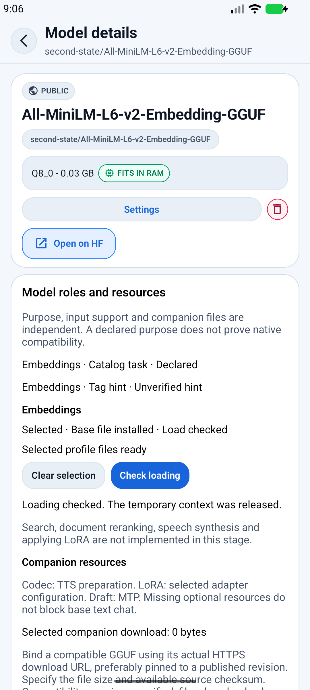
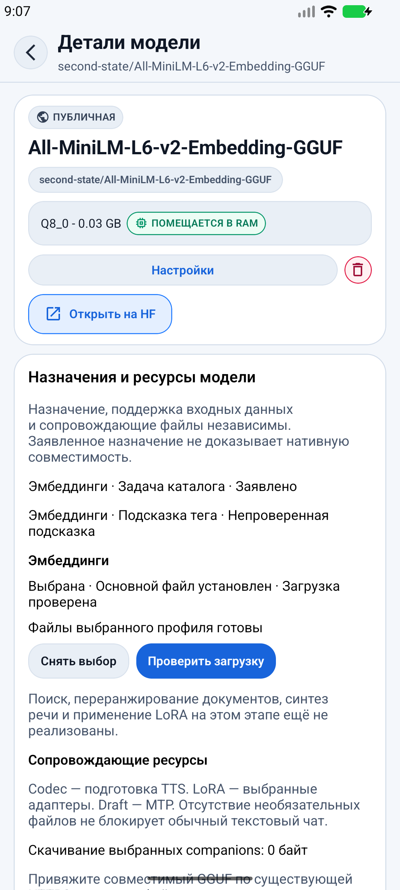
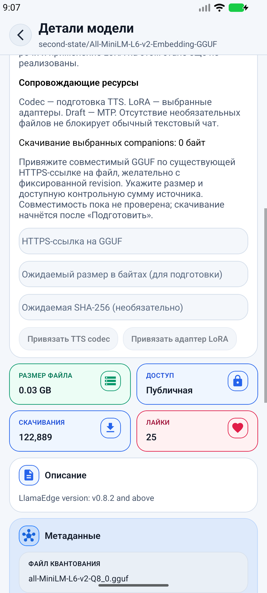

# Model resources Android acceptance

The explicit `inference` pack runs the existing CPU inference smoke first, then
`runtime-model-resources`. The second scenario uses the production download manager,
auxiliary selection service and the shared engine lifecycle. It never initializes a
separate QA context outside the resource owner.

## Pinned fixtures

| Resource | Identity |
|---|---|
| Chat A repository | `Mungert/SmolLM2-135M-Instruct-GGUF` |
| A revision | `980b4318b34b2f20e60c89d8f8a98283ec83cbd6` |
| A file | `SmolLM2-135M-Instruct-q8_0.gguf` |
| A SHA-256 | `bc64cce8e1c11e4ed870633b557e04af718249c817c4cf8a6784116144ec3e28` |
| Embedding B repository | `second-state/All-MiniLM-L6-v2-Embedding-GGUF` |
| B revision | `544f204f2eaa2d71361ffc74d6df7170285b286a` |
| B file | `all-MiniLM-L6-v2-Q8_0.gguf` |
| B bytes | `25008064` |
| B SHA-256 | `263215c3cadd6e16740741a7624ab4cbb6c8e777688bd5331ecfbf5681c2f8ed` |
| B expected embedding dimensions | `384` |

B is explicitly prepared through the ordinary queue, GGUF header verification,
expected size and upstream SHA-256 checks. Files may be reused only when the pinned
identity and integrity receipt match; the auxiliary service revalidates bytes before
native initialization. The scenario does not publish the embedding vector or input.

## Scenario and evidence

From the public repository root:

```sh
node scripts/android-scenarios.js --emulator --pack inference --isolated-qa-install --fail-on-skip
```

The isolated Release package and current source/APK provenance checks are required.
The pack is excluded from `all` and the default Android CI matrix. Both scenarios must
run in order in the same app process; stage 2 refuses to run without a passed baseline.

The stage 2 sequence loads A with CPU/context 512, generates real tokens, prepares B,
selects B for embedding without changing the chat selection, performs a real embedding
operation through the production service, confirms B's release and A's restoration,
then generates another real answer. It checks that the chat thread, its messages and
chat settings are identical across the B operation, the native context generation has
changed, and A still uses CPU/context 512. A short embedding output must have exactly
384 finite values. Counters and booleans are saved in
`artifacts/android-scenarios/model-resources-evidence.json`; vectors, prompts, answers,
private paths and raw native errors are excluded.

Native deadlines do not authorize another context. Failure stops the isolated QA
package, and uncertain native ownership skips in-app cleanup. Native operations have
a 120s scenario deadline; fixture download has a 300s deadline. Existing engine
watchdogs, fail-closed release handling and bounded operation drains remain active.

## Execution on 2026-09-21

The final run used Android 16 / API 36, `sdk_gphone64_x86_64`, 8192 MiB RAM,
CPU only, with context 512 and zero GPU layers. Both scenarios ran in sequence on
the newly built isolated Release APK. The package was not force-stopped between them.

| Build identity | Value |
|---|---|
| Public source commit | `bfc8362baae8f75cbbb42730e16bdc4426698ca6` |
| Public source tree | `59fe122cfc2f3b9ae6ed06b818c1ce3341d597f3` |
| Source state at build | Clean; only acceptance documentation/evidence added afterward |
| Package / version | `com.github.tah10n.pocketai.qa`, Release, `1.6.3` / `22` |
| ABI / APK bytes | `x86_64` / `81843190` |
| Built **and installed** APK SHA-256 | `3b6443544b4666da75dd454422111de4ad0037baf62ff5b8710ad2e52b729788` |
| Runtime | Exactly `llama.rn 0.13.0-rc.3` |

The runner checked build provenance and read back the installed APK identity.
The sanitized [provenance record](validation/llama-rn-stage2/acceptance-provenance.json)
retains the public source and binary identities without host paths.

| Check | Status | Evidence / reason |
|---|---|---|
| Existing CPU inference smoke on stage 2 APK | passed | Actual CPU load, answer, stop after token, next answer, new-chat isolation, unload/reload and another answer; [counters](validation/llama-rn-stage2/inference-lifecycle-evidence.json) |
| Native A → B → A sequence | passed | 20 predicted tokens before and after B, 384 finite embedding values, changed native context, unchanged chat and settings; [counters](validation/llama-rn-stage2/model-resources-evidence.json) |
| Stage 2 APK / installed APK identity | passed | Both hashes match the identity above; embedded bundle, no Metro |
| Ordinary model-details load check | passed | Temporary context released; success receipt survives reopening details and a cold restart of the QA package |
| EN/RU visible flow | passed | Selection, file readiness, native check, deferred-feature explanation and companion inputs visually inspected |
| Native reranker loading | not_run | No separate pinned reranker fixture exercised; parameters and lifecycle have behavioral test coverage |
| iOS / physical GPU or NPU | not_run | This run used one Android CPU emulator; those targets need separate native evidence |
| TTS synthesis / LoRA application | not_run | Outside this stage; companion readiness does not claim operation support |

The fixtures were already present from an earlier preparation through the ordinary
download queue. Their pinned size/hash checks were repeated before native use. An
earlier 4096 MiB emulator attempt passed the baseline and fixture preparation, then
refused auxiliary loading under the existing strict free-memory policy. The ordinary
load-check UI reported insufficient memory (about 222 MiB free versus a roughly
304 MiB admission estimate). Increasing the test emulator to 8192 MiB allowed the
sequence; no memory-policy bypass was added. This is not a claim that every 4 GiB
device can run this profile.

The focused catalog/runtime regression batch passed 343 tests, including 12 cases
first reproduced as failing: preserving load/embedding receipts on refresh, rejecting
changed SHA/revision, and preventing stale route/queue data from resurrecting cleared
receipts after a fresh same-identity download. These tests are separate from the native
evidence above.

## Release verification

`npm run verify:release` passed after native acceptance: Rust formatting/clippy/tests,
TypeScript, lint, all **219 Jest suites / 4698 tests**, and the native configuration
contract. This final run was sequential, after stopping the emulator and build
processes. An earlier concurrent build/test run was interrupted after timing-sensitive
UI test failures; the clean sequential run passed without weakening test deadlines.

## UI evidence

The English screenshot follows an ordinary successful load check. The Russian
screenshots follow reopening the same checked model and scrolling to companion
controls. Selection and the receipt also survived a subsequent cold app restart.




