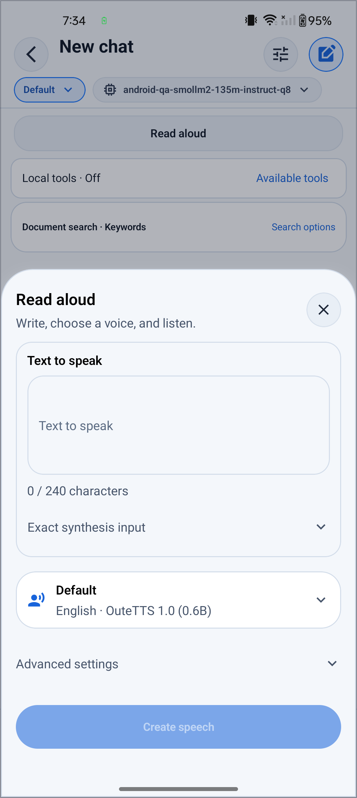

# Recommended English voice: scoped phone acceptance

Source: `8338889bd4d579e6da92f26ceab08eff53ae45de`. ARM64 APK: `24ad9c0ee90003b7cd59ebf02b8c08f3f10839ff539d3c522dc10729534c2ac1` (145704589 bytes). The later report commit does not change this source/APK identity.

OuteTTS 1.0 0.6B Q4_K_M with DAC F16 is the recommended speakerless English profile. One physical Android CPU device, four threads and zero GPU layers were exercised. Limits remain 240 characters, 512 prompt tokens and 16 seconds of mono 24 kHz audio. Reference conditioning and phonemizer acceptance remain incomplete.

Three explicit fresh generations, including after Stop and after cold restart, each passed independent local tiny.en ASR with zero edits over the same eight-word synthetic target. Audio and ASR-model hashes were checked before and after each evaluation. Naturalness and voice similarity were not evaluated. Identical deterministic WAV hashes do not substitute for fresh inference.

| Case | Native prompt / generated tokens | Native completion ms | Seconds until observed | ASR edits / words |
| --- | ---: | ---: | ---: | ---: |
| v6-fresh1 | 16 / 579 | 17186 | 47 | 0 / 8 |
| v6-after-stop | 16 / 579 | 17026 | 46 | 0 / 8 |
| v6-cold-new | 16 / 579 | 16976 | 46 | 0 / 8 |

The observed 46–47 seconds include decode, player progression and host probing; they are not isolated synthesis latency. Per-case memory admission and PCM normalization are retained in the machine record, not presented as measured peak memory.

Stop was observed during native synthesis, followed by stopped/cancelled and no WAV; the next fresh synthesis passed. Replay reused the same WAV and native completion: two current unmuted Android AudioTracks at 24 kHz proved playback. The original failed CRLF controller receipt remains failed. After cold restart, phase null meant no TTS state before explicit generation; no automatic synthesis was observed.

After TTS, an ordinary fresh completed answer from model A exposed 35 prompt and 20 generated native tokens through generation-runtime-tokens. This proves scoped ordinary restoration, not A+LoRA restoration.

## Using the ordinary UI

1. Choose or explicitly install the recommended English voice in the existing speech sheet.
2. Enter a short English draft and choose **Create speech**. **Replay** uses the finalized clip without another synthesis.
3. Use Stop to cancel an active operation; start a new synthesis explicitly after it drains.
4. Close the sheet to return to chat. Cold reopening does not automatically synthesize.

Local exact-source verification passed: 296 Jest suites / 6,924 tests, Rust 68 unit + 3 integration tests, TypeScript, lint and native configuration; targeted 625 tests / 14 suites and 75 final UI tests passed separately.

Source CI snapshot: **failed_attempt_one_retry_requested**. Attempt-one API 33 packaging failed with Java heap exhaustion; its native scenarios were not run. The failed-jobs-only retry on the unchanged source is separate: **API 33 retry job 112413115486 in progress at 2026-10-06T17:59Z; attempt-one job failures remain historical observations; retry outcome pending**. Other job results and optional Android QA skipped are recorded individually. Hosted build checks do not replace phone execution.

## Limits and retained outcomes

Earlier admission, publication and content failures remain in the machine record, including the OuteTTS 0.3 six-of-eight-word errors. V6 offscreen Replay, CRLF, preflight file-sharing, cold and pre-Send chat screenshot pulls, null-phase and flattened-content controller failures remain host outcomes. No codec, quantization or application defect is inferred from them.

Stage 7 remains incomplete: reference create/bake/release and conditioning, successful required phonemizer speech, A+LoRA restoration, Russian, iOS execution, Bluetooth and GPU routes are not accepted by this speakerless English result. No reference-handle lifetime claim is inferred from a speakerless path.

[Detailed outcomes](acceptance-default-v6.json) · [Recommended profile and results](recommended-voice.json) · [Stage 6 fixture origins](../llama-rn-stage6/tts-fixtures.json)

